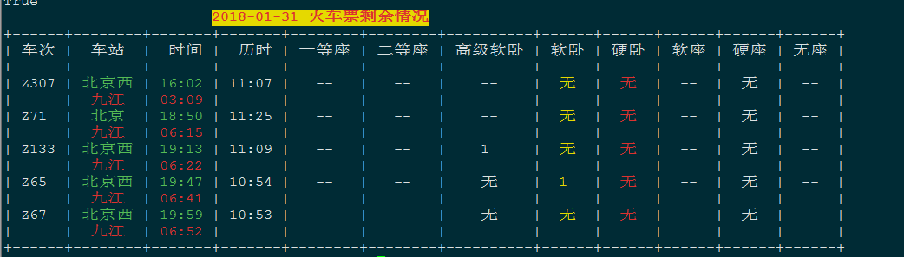

# 练习python 爬虫 #

## python 2.7 运行 ##

## 文件目录 ##
* * *
     ├── finance
    │   ├── Anaconda2-5.0.1-Linux-x86_64.sh
    │   ├── dapan.py
    │   └── movie_band.py
    ├── lianjia
    │   └── lianjia_test.py
    ├── lottery
    │   ├── lottery.csv
    │   ├── sina_rb.py
    │   └── sina_ssq.py
    ├── README.md
    └── tickets
    │   ├── parse_stations.py
    │   ├── stations.py
    │   ├── stations.pyc
    │   └── tickets.py

4 directories, 12 files
* * *
### finace ### 
    金融方面 大盘 电影票房
### lianjia ###
    抓取链家成交房产 
### lottery ### 
    双色球 
### tickets ###
    12306火车票剩余情况 
* * *
   [火车票](./ticket.png)
   
* * *
